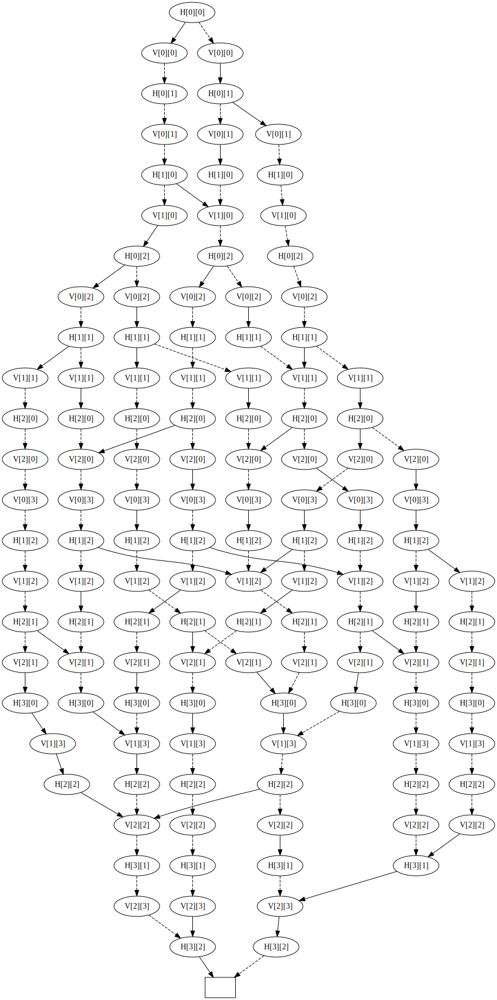
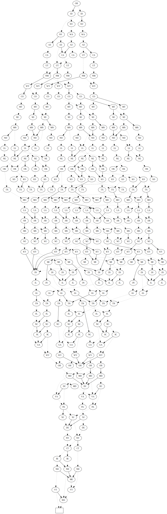
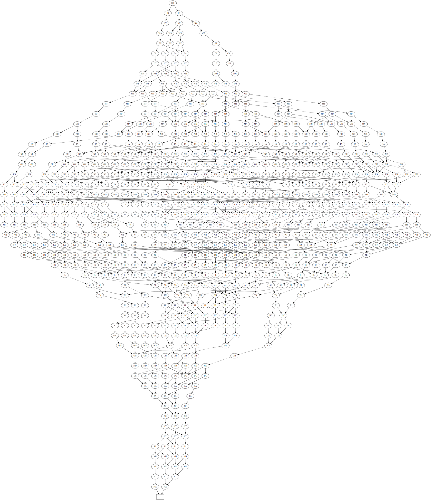
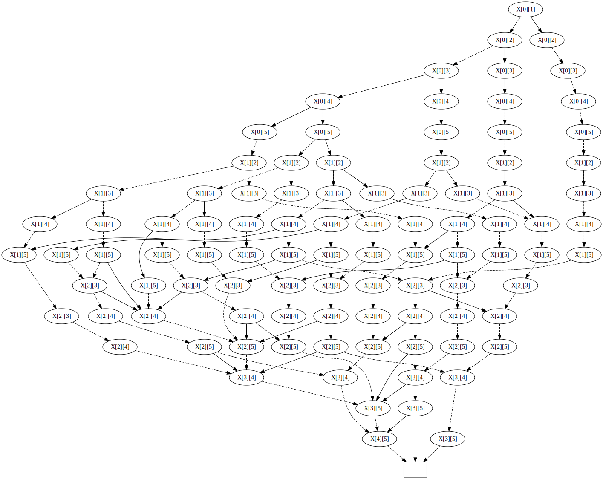

# Examples

## Exact cover problem

```sh
$ cargo run --release --example exact_cover
```



## Independent set and kernel of graph.

See "The Art of Computer Programming, 7.1.4. Binary Decision Diagrams" for more information.

```sh
$ cargo run --release --example united_states
```

### Independent set



### Kernel



## Set partition problem

```sh
$ cargo run --release --example set_partition
```

