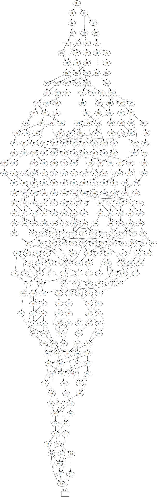

# Examples

## Exact cover problem

```sh
$ cargo run --release --example exact_cover
Num answers: 44
Num nodes: 128
```


## Independent set and kernel of graph.

See "The Art of Computer Programming, 7.1.4. Binary Decision Diagrams" for more information.

```sh
$ cargo run --release --example united_states
The number of independent sets: 211954906
The number of independent set bdd nodes: 339
The number of kernels: 266137
The number of kernel bdd nodes: 79
```

### Independent set



### Kernel


## Set partition problem

```sh
$ cargo run --release --example set_partition
Num answers: 76
Num nodes: 97
```


## Thue-Morse sequence

Example of linear boolean programming.
Optimize kernel of cycle graph.
Weight of each node is defined by Thue-Morse sequence.

```sh
$ cargo run --release --example thue_morse_sequence
The number of nodes in bdd: 252
Cycle graph: 1 - 2 - 3 - ... - 33 - 1
OPT: 10
OPT SET: 3 6 9 12 15 18 20 23 **25** 27 30 33
```